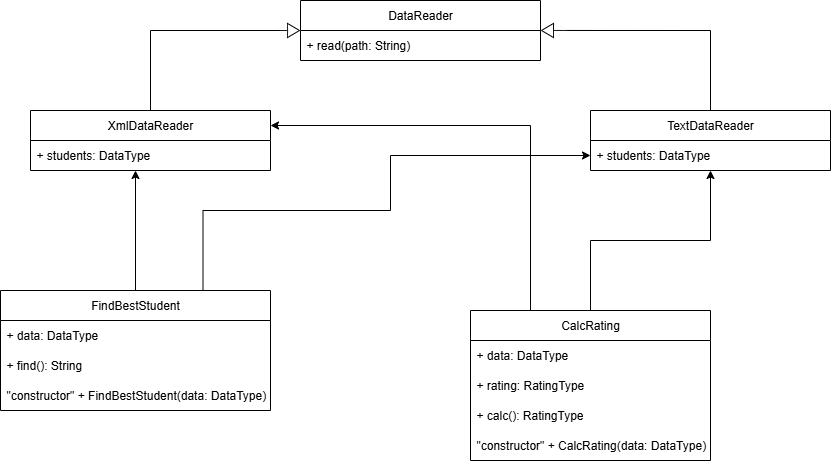

# Лабораторная работа №1 по дисциплине "Технологии программирования и инструментальные средства разработки систем искусственного интеллекта"
## Программа рассчитывает средний рейтинг студентов по дисциплинам при чтении данных с файла формата ".txt"
## Вариант №3
## Задача: реализовать чтение данных с файлов формата ".XML" и реализовать класс для определения студента, имеющего 100 баллов по всем дисциплинам. Если таких студентов несколько, нужно вывести любого из них. Если таких студентов нет, необходимо вывести сообщение об их отсутствии.

# Диаграмма классов

